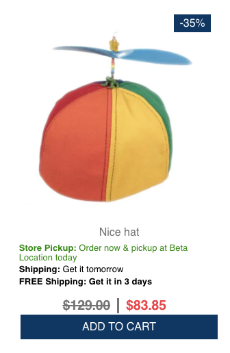
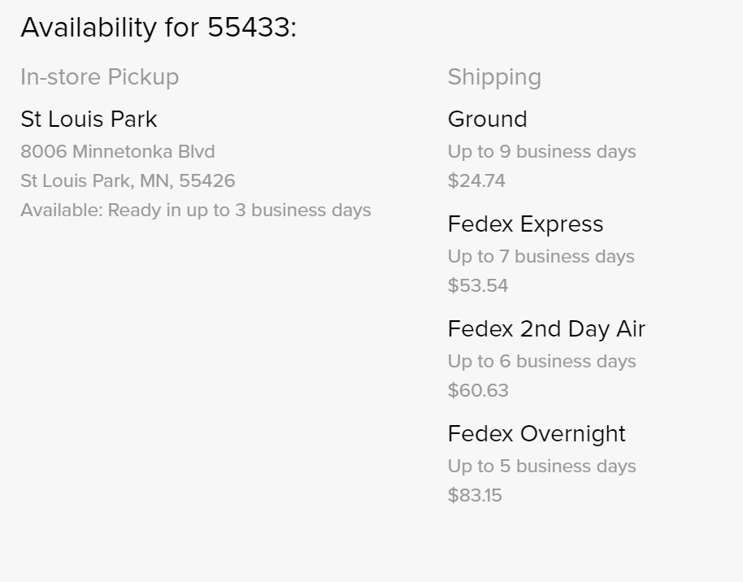

📢 Use this project, [contribute](https://github.com/vtex-apps/location-availability) to it or open issues to help evolve it using [Store Discussion](https://github.com/vtex-apps/store-discussion).

# Location Availability

<!-- DOCS-IGNORE:start -->
<!-- ALL-CONTRIBUTORS-BADGE:START - Do not remove or modify this section -->

[](#contributors-)

<!-- ALL-CONTRIBUTORS-BADGE:END -->
<!-- DOCS-IGNORE:end -->

This app provides availability and shipping information based on the user's location, if available at the session, to have a more accurate result, even without authentication. We recommend using this app along with `vtex.shopper-location`; you can find more information about this app [here](https://github.com/vtex-apps/shopper-location).



## Configuration

1. [Install](https://vtex.io/docs/recipes/development/installing-an-app/) the Location Availability app by running `vtex install vtex.location-availability@0.x`.
2. Open your store's Store Theme app directory in your code editor.
3. Add the Location Availability app as a `peerDependency` in the `manifest.json` file:

```diff
 "peerDependencies": {
+  "vtex.location-availability": "0.x"
 }
```

Now, you are able to use the blocks exported by the `location-availability` app:

### Availability Summary: `product-location-availability`

This block summarizes a product's availability and is best used on product shelves. By default it will show the two fastest shipping options (or one shipping option and the fastest in-store pickup option). Alternative configurations are available using the props below:

| Prop name      | Type      | Description                                                   | Default value |
|----------------|-----------|---------------------------------------------------------------|---------------|
| `maxItems`     | `number`  | Maximum number of availability options shown per product      | `2`           |
| `orderBy`      | `enum`    | Sort the availability options by `faster` or `cheaper`        | `faster`      |
| `pickupFirst`  | `boolean` | If available, show in-store pickup before other options       | `true`        |
| `measurements` | `string`  | Add the necessary measurement options `kilometers` or `miles` | `miles`       |

**Example**

```diff
  ...
  "product-summary.shelf#home": {
    "children": [
      "product-summary-image#home",
      "product-summary-name",
+     "product-location-availability",
      "product-summary-sku-selector",
      "flex-layout.row#product-price"
    ]
  },
+  "product-location-availability": {
+    "props": {
+      "maxItems": 3
+      "orderBy": "cheaper"
+      "pickupFirst": false,
+      "measurements": "kilometers"
+    }
+  }
...
```

### Availability Details

These blocks provide more detailed availability information and are designed for use on the PDP (product details page). Each block's information will automatically update if either the user's location or the selected SKU are changed.

**`location-context`**: This block provides the location and availability data which the other blocks display. If you wish to use any of the following blocks, this block must be set as their parent (see example below).

**`product-location-availability-header`**: This block displays a header for the availability section, i.e. "Availability for 90210:". It can be configured to style the postal code as a link, if you wish to use this block as a trigger for the `ChangeLocation` modal from `vtex.shopper-location`.

| Prop name     | Type      | Description                            | Default value |
| ------------- | --------- | -------------------------------------- | ------------- |
| `styleAsLink` | `boolean` | Style the user's postal code as a link | `false`       |

**`product-location-shipping-options`**: This block displays the available shipping options for the selected SKU based on the user's current location.

**`product-location-pickup-options`**: This block displays the stores which have availability for the selected SKU and that are nearby the user's current location. If more than 3 stores meet this criteria, a "See All Stores" button is also rendered which opens the full list of stores in a modal window when clicked.

**Example**

```diff
...
"flex-layout.col#right-col": {
    "props": {
      "preventVerticalStretch": true,
      "rowGap": 0
    },
    "children": [
      "flex-layout.row#product-name",
      "product-rating-summary",
      "flex-layout.row#list-price-savings",
      "flex-layout.row#selling-price",
      "product-installments",
      "product-separator",
      "product-identifier.product",
      "sku-selector",
      "product-quantity",
      "product-assembly-options",
      "product-gifts",
      "flex-layout.row#buy-button",
+     "location-context",
      "share#default"
    ]
  },
+  "location-context": {
+    "children": [
+      "modal-trigger#location-availability",
+      "flex-layout.row#location-availability"
+    ]
+  },
+  "flex-layout.row#location-availability": {
+    "children": [
+      "product-location-pickup-options",
+      "product-location-shipping-options"
+    ]
+  },
+  "modal-trigger#location-availability": {
+    "children": ["product-location-availability-header", "modal-layout#address"]
+  },
+  "product-location-availability-header": {
+    "props": {
+      "styleAsLink": true
+    }
+  },
...
```

The above JSON will render an availability section that looks like this:



## Customization

In order to apply CSS customizations in this and other blocks, follow the instructions given in the recipe on [Using CSS Handles for store customization](https://vtex.io/docs/recipes/style/using-css-handles-for-store-customization).

| CSS Handles                |
| -------------------------- |
| `container`                |
| `shippingOption`           |
| `postalCode`               |
| `regularShippingLabel`     |
| `regularShipping`          |
| `time`                     |
| `ETA`                      |
| `firstShippingOption`      |
| `freeShippingLabel`        |
| `freeShipping`             |
| `cannotBeDeliveredLabel`   |
| `cannotBeDelivered`        |
| `pickUpLabel`              |
| `pickUp`                   |
| `getTomorrow`              |
| `getInDays`                |
| `availabilityHeader`       |
| `availabilityHeaderLink`   |
| `storeListContainer`       |
| `storeListEmptyMessage`    |
| `pickupHeader`             |
| `storeList`                |
| `pickupItem`               |
| `pickupName`               |
| `pickupAddress`            |
| `pickupCityStateZip`       |
| `pickupEstimate`           |
| `pickupUnavailable`        |
| `seeAllModalButton`        |
| `seeAllModalButtonText`    |
| `modalContainer`           |
| `modalHeader`              |
| `modalStoreList`           |
| `shippingListContainer`    |
| `shippingHeader`           |
| `shippingListEmptyMessage` |
| `shippingList`             |
| `shippingListItem`         |
| `shippingDeliveryName`     |
| `shippingDeliveryEstimate` |
| `shippingDeliveryPrice`    |
| `estimateTranslated`       |
| `distance`                 |
| `distanceEstimate`         |

<!-- DOCS-IGNORE:start -->

## Contributors ✨

Thanks goes to these wonderful people:

<!-- ALL-CONTRIBUTORS-LIST:START - Do not remove or modify this section -->
<!-- prettier-ignore-start -->
<!-- markdownlint-disable -->
<!-- markdownlint-enable -->
<!-- prettier-ignore-end -->

<!-- ALL-CONTRIBUTORS-LIST:END -->

This project follows the [all-contributors](https://github.com/all-contributors/all-contributors) specification. Contributions of any kind are welcome!

<!-- DOCS-IGNORE:end -->
